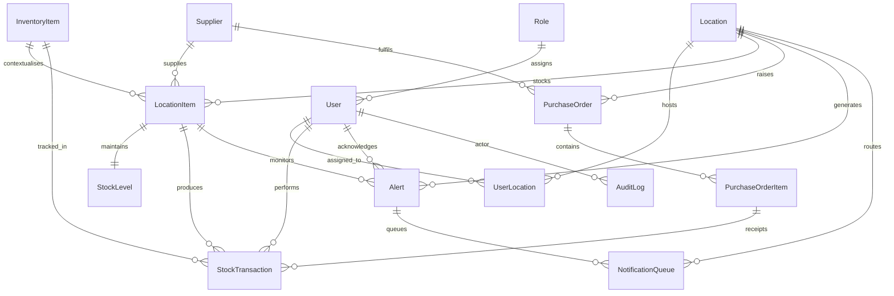

# Database Schema Overview

This document outlines the relational data model that underpins the inventory, purchasing, and alerting workflows. The schema is implemented with Prisma in `api/prisma/schema.prisma` and deployed through migration scripts in `api/prisma/migrations`.

## Entity Relationship Diagram

## Key Entities

| Entity | Purpose | Notable Fields |
| --- | --- | --- |
| `Role` | Access control roles applied to users. | `name` (unique), soft delete via `deleted_at`. |
| `User` | Person operating the system. | `email` (unique), `role_id`, soft delete. |
| `Location` | Physical site such as a warehouse or storefront. | `code` (unique), timezone, soft delete. |
| `InventoryItem` | Canonical catalog item available to one or more locations. | Optional `master_sku`, soft delete. |
| `LocationItem` | Location-specific stocking of an inventory item. | `sku` (unique per location), pricing, reorder thresholds, soft delete. |
| `StockLevel` | Current quantity snapshot for a `LocationItem`. | Enforces one row per location item. |
| `StockTransaction` | Immutable movement or adjustment of stock. | Links to item, location, optional purchase order line, performer. |
| `Supplier` | Vendor record for purchase orders and stocking. | `name` (unique), soft delete. |
| `PurchaseOrder` | Procurement request sent to a supplier. | Status enum, references location and users who ordered/approved. |
| `PurchaseOrderItem` | Line items for purchase orders. | Quantities ordered/received, unit cost. |
| `Alert` | System generated notification for stock/audit events. | Type, severity, status, optional location item reference. |
| `NotificationQueue` | Outbound notifications awaiting processing. | Channel enum, delivery attempts, scheduling metadata. |
| `AuditLog` | Append-only change history for audited tables. | Entity name/id, action, optional actor and request metadata. |

## Normalisation and Constraints

- **Unique SKU per location**: `location_items` includes `UNIQUE(location_id, sku)` ensuring a location cannot duplicate a SKU.
- **Soft deletes**: Business tables carry a nullable `deleted_at` column. Updates that set or clear this timestamp are captured in audit logs as `DELETE`/`RESTORE` actions to retain history while keeping the row.
- **Reference integrity**: Foreign keys use `RESTRICT` or `SET NULL` semantics to prevent orphan records while preserving history on optional relationships.
- **Enumerations**: Prisma enums back key lifecycle states (`PurchaseOrderStatus`, `AlertStatus`, `NotificationStatus`, etc.) to keep domain status transitions explicit.

## Auditing Strategy

All operational tables (roles, users, locations, inventory, purchasing, stock, alerts, notifications) share the `log_audit_event` trigger defined in the initial migration. The trigger:

1. Detects the DML operation (`INSERT`, `UPDATE`, `DELETE`).
2. Identifies soft-delete and restore transitions using the `deleted_at` column.
3. Captures before/after snapshots for updates, and full row payloads for inserts/deletes.
4. Stores the audit entry in `audit_logs` including optional `app.current_user_id` and `app.request_id` values if the application sets them in the current session.

This ensures a tamper-evident change history without requiring application-level logging logic for every table.

## Stock and Purchasing Flow

1. `PurchaseOrder` and `PurchaseOrderItem` records capture inbound supply commitments.
2. When goods arrive, `StockTransaction` rows (type `INBOUND`) reference the purchase order item, and `StockLevel` totals can be recalculated or incremented.
3. Operational movements (`OUTBOUND`, `ADJUSTMENT`, `TRANSFER`, `COUNT`, `SALE`, `RETURN`) also create transactions, preserving an immutable ledger of quantity changes.
4. Alerts (e.g., low stock, delayed purchase orders) reference the affected `LocationItem` and enqueue `NotificationQueue` entries for downstream processors.

## Seed Data

The initial migration and `prisma db seed` target provide reference data for:

- Baseline roles (`admin`, `manager`, `staff`).
- Sample locations for New York, San Francisco, and London to demonstrate multi-site operations.

Developers can extend seeding in `api/prisma/seed.js` with additional fixtures for local testing.
