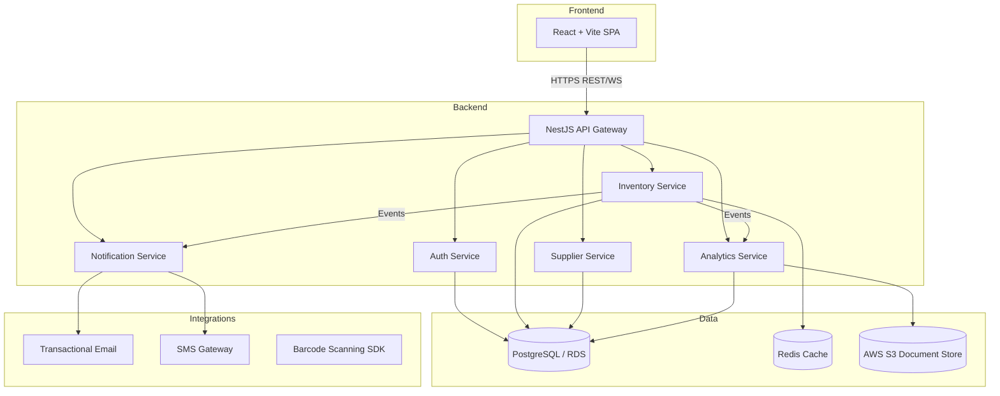
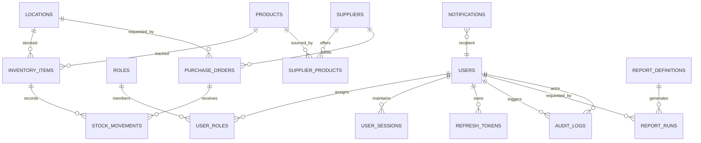

# Restaurant Inventory Platform – Technical Architecture Specification

## 1. Vision & Scope

### Goals
- Provide restaurant operators with end-to-end visibility into stock levels, supplier performance, and consumption trends across locations.
- Automate replenishment workflows, barcode-based stock-taking, and exception notifications to reduce waste and stockouts.
- Deliver actionable analytics and forecasting dashboards for purchasing, menu engineering, and operational planning.

### Non-Goals (Phase 1)
- Native mobile applications (mobile web is sufficient initially).
- Real-time IoT scale integrations (temperature sensors, kitchen monitors) beyond barcode scanning support.
- Complex machine learning forecasting (initially rely on rules-based alerts and curated reports).

## 2. High-Level Architecture

## 3. Technology Stack & Dependencies

| Layer | Technology | Rationale |
| --- | --- | --- |
| Backend | [NestJS](https://nestjs.com/) | Opinionated TypeScript framework with modular architecture, built-in DI, and mature ecosystem. |
| ORM / Database Access | [Prisma](https://www.prisma.io/) | Type-safe schema management, migrations, and query builder for PostgreSQL. |
| Database | PostgreSQL (Amazon RDS) | Strong relational capabilities ideal for transactional inventory systems. |
| Caching | Redis (Amazon ElastiCache) | Accelerates read-heavy endpoints, session tracking, and rate limiting. |
| Message/Event Bus | Amazon SQS (initially), upgradable to SNS/SQS fan-out | Decouples services for asynchronous notifications, analytics ingestion, and long-running processes. |
| Frontend | Vite + React + TypeScript | Fast DX, modern tooling, component-driven UI. |
| UI Toolkit | Tailwind CSS + Headless UI | Rapid, accessible component styling. |
| Auth | JWT access tokens + refresh tokens stored in HTTP-only cookies | Secure, stateless authentication with support for multi-channel clients. |
| Reporting | dbt + Metabase (hosted) | Transform warehouse tables for analytics, provide dashboards and exports. |
| CI/CD | GitHub Actions, PNPM/Yarn, Docker | Automated testing, linting, and deployments. |
| Infrastructure as Code | Terraform | Consistent environment provisioning (VPC, ECS, RDS, S3, CloudFront). |
| Hosting | AWS ECS Fargate for services, AWS S3 + CloudFront for frontend | Managed compute with minimal ops overhead. |
| Observability | AWS CloudWatch + OpenTelemetry + Sentry | Metrics, tracing, and error tracking. |

## 4. Backend Service Boundaries

### Auth Service
- Responsibilities: user registration, login, password reset, session management, role/permission delegation, multi-factor auth (Phase 2).
- Data: `users`, `roles`, `user_sessions`, `refresh_tokens` tables.
- Integrations: Email service for verification/reset, Redis for session revocation.

### Inventory Service
- Responsibilities: product catalog, stock counts per location, stock adjustments (manual, barcode scans), stock movement history, purchase order orchestration.
- Data: `products`, `inventory_items`, `stock_movements`, `locations`, `purchase_orders`, `inventory_snapshots`.
- Integrations: Barcode scanning SDK (browser-based), Notification service for low-stock alerts, Supplier service for fulfilment data.

### Supplier Service
- Responsibilities: supplier directory, contract terms, order status tracking, invoice metadata, lead times.
- Data: `suppliers`, `supplier_contacts`, `supplier_products`, `purchase_order_statuses`.
- Integrations: External EDI/API connectors (Phase 3), Notification service for order events.

### Analytics Service
- Responsibilities: ETL to analytics schema, report generation, scheduled CSV/email exports, trend alerts.
- Data: `report_definitions`, `report_runs`, curated materialized views in PostgreSQL, exports in S3.
- Integrations: Metabase for BI, Notification service for scheduled report delivery.

### Cross-Cutting Services
- **API Gateway Module**: Aggregates service modules, handles routing, rate limiting, OpenAPI schema generation.
- **Notification Service**: Abstracts email/SMS/push, template management, event-driven dispatch via SQS workers.
- **Audit & Compliance Module**: Central audit trail for sensitive actions, leverages immutable log table and S3 cold storage.

Services are deployed as isolated NestJS modules sharing a mono-repo but packaged into independent Docker images to allow scaling based on usage (Inventory Service likely highest load).

## 5. Frontend Architecture

- **Application Shell**: React SPA bootstrapped with Vite, using React Router for client-side routing and Redux Toolkit Query (RTK Query) for API data fetching/caching.
- **State Management**: RTK Query for server cache + Zustand for UI state where needed.
- **Module Structure**:
  - `auth`: login, registration, MFA setup, user management.
  - `inventory`: dashboards, stock counts, barcode scan workflows, adjustment approvals.
  - `suppliers`: supplier list, contracts, purchase order creation and tracking.
  - `analytics`: report explorer, saved dashboards, export scheduling.
  - `admin`: role management, feature flags, audit logs.
- **Component Library**: Shared UI library in `components/ui`, utility hooks in `lib/hooks`, domain-specific components per module.
- **Testing**: Vitest + React Testing Library; Playwright for end-to-end flows in CI matrix.
- **Offline/Device Support**: Service worker for caching critical assets; barcode scanning via WebAssembly or WebUSB integration with supported scanners.

## 6. Data Management & ERD

### Primary Database Schema

### Data Flow
1. **Inventory Updates**: Barcode scan submits to Inventory Service → validates product → creates `stock_movement` → pushes event to SQS → Notification Service evaluates thresholds → optional alert to managers.
2. **Purchase Order Lifecycle**: Inventory Service flags low stock → creates draft `purchase_order` → Supplier Service enriches with supplier data → Authenticated user approves → Status updates trigger notifications.
3. **Analytics Pipeline**: Nightly job (AWS ECS scheduled task) extracts transactional tables → transforms with dbt into analytics schema → Materialized views power Analytics Service APIs → Metabase dashboards query views.

### Caching Strategy
- Hot lists (products, suppliers) cached in Redis with TTL.
- Session revocation list stored in Redis to support immediate logout and token invalidation.

## 7. API Surface Summary (v1)

| Service | Endpoint | Method | Description |
| --- | --- | --- | --- |
| Auth | `/api/auth/register` | POST | Create operator account (admin gated). |
| Auth | `/api/auth/login` | POST | Issue JWT access + refresh tokens. |
| Auth | `/api/auth/refresh` | POST | Rotate access token using refresh token. |
| Auth | `/api/auth/logout` | POST | Revoke refresh token, blacklist session. |
| Auth | `/api/users` | GET | List users (role-based authorization). |
| Auth | `/api/users/:id/roles` | PATCH | Assign or revoke roles. |
| Inventory | `/api/products` | GET/POST/PATCH | CRUD product catalog. |
| Inventory | `/api/locations` | GET/POST/PATCH | Manage restaurant locations. |
| Inventory | `/api/inventory` | GET | Query inventory state with filters. |
| Inventory | `/api/inventory/:id/adjust` | POST | Submit stock adjustment (barcode or manual).
| Inventory | `/api/purchase-orders` | GET/POST | Create and manage purchase orders. |
| Inventory | `/api/purchase-orders/:id/status` | PATCH | Update PO status (approve, receive, cancel). |
| Inventory | `/api/stock-movements` | GET | Audit trail for stock changes. |
| Supplier | `/api/suppliers` | GET/POST/PATCH | Manage suppliers and contacts. |
| Supplier | `/api/supplier-products` | GET | View supplier-product mappings. |
| Supplier | `/api/supplier-performance` | GET | KPI summary for supplier reliability. |
| Analytics | `/api/reports` | GET | List available reports/dashboards. |
| Analytics | `/api/reports/:id/run` | POST | Trigger and fetch report data/export. |
| Analytics | `/api/alerts` | POST | Configure threshold-based alerts. |
| Notification | `/api/notifications/preferences` | GET/PATCH | User notification channels + frequency. |

All endpoints secured via JWT bearer tokens; service-to-service calls use signed JWTs with short TTL and mTLS inside the VPC.

## 8. Authentication & Security Model

- **Authentication**: NestJS Passport strategies for email/password (Phase 1) with planned OAuth provider support. Access token (15 min TTL) + refresh token (7 day TTL) issued on login, both stored in HTTP-only Secure cookies. Refresh token rotation and detection of reuse enforced (token family tracked in PostgreSQL + Redis blacklist).
- **Authorization**: Role-based access control (RBAC) with fine-grained permissions stored in `roles` table. Inventory actions require explicit scopes (e.g., `inventory.adjust`, `purchase_orders.approve`).
- **Transport Security**: TLS 1.2+ enforced at CloudFront and API Gateway load balancers. Internal traffic limited to VPC.
- **Secrets Management**: AWS Secrets Manager for database credentials, API keys, JWT signing keys; rotated quarterly.
- **Data Protection**: At-rest encryption (RDS, S3, Redis). PII minimized; audit logs immutable (write-once with hash chaining). Hourly automated backups with point-in-time recovery.
- **Compliance Considerations**: SOC2-aligned controls, audit trails, least-privilege IAM roles. Optional GDPR compliance with data deletion workflows in roadmap.

## 9. Integrations & External Dependencies

- **Email**: Postmark or AWS SES for transactional emails (verification, reports, alerts). Templates stored in Notification Service with Handlebars rendering.
- **SMS**: Twilio or AWS SNS SMS for urgent alerts (delivery receipts stored in `notifications`).
- **Barcode Scanners**: Browser-based via WebUSB/WebHID (Honeywell, Zebra). Provide fallback manual entry; support for scanning SDK to map keystrokes to product codes.
- **Accounting (Phase 3)**: Planned connectors with QuickBooks Online/Xero for purchase order synchronization.
- **Authentication Providers (Phase 2)**: SAML/OIDC integration for enterprise single sign-on.

## 10. Hosting Strategy & Environment Layout

- **Environments**: `dev` (shared sandbox), `staging` (pre-production mirror), `prod` (high-availability). Each environment has isolated VPC, RDS instance, S3 buckets, Redis cluster. Feature environments can be spun up on demand via Terraform workspaces.
- **Backend Deployment**: Docker images built by GitHub Actions, stored in Amazon ECR, deployed to AWS ECS Fargate with blue/green deployments via CodeDeploy.
- **Frontend Deployment**: Static assets built by Vite, uploaded to S3, distributed via CloudFront with invalidations triggered post-deploy.
- **CI/CD Pipeline**:
  1. **Lint/Test Stage**: Run ESLint, Jest/NX tests, Prisma schema checks, db migration dry-run.
  2. **Build Stage**: Produce Docker images + frontend bundle.
  3. **Security Stage**: Snyk/Dependabot scans, Trivy image scans.
  4. **Deploy Stage**: Terraform apply (in staging/prod), ECS deploy, CloudFront invalidation.
- **Infrastructure Observability**: Terraform state stored in AWS S3 with DynamoDB locking. CloudWatch alarms for CPU/memory, RDS performance insights, uptime monitoring via Pingdom.

## 11. Reporting & Analytics Architecture

- Operational data captured in PostgreSQL (OLTP).
- Nightly ETL to analytics schema using dbt; heavy aggregations stored as materialized views.
- Analytics Service exposes REST endpoints for dashboards; Metabase connected to read-only analytics schema for self-service BI.
- Scheduled report runs stored in S3, distributed via email/S3 pre-signed URL.
- Future milestone: optional Snowflake/Redshift warehouse if analytics requirements outgrow RDS.

## 12. Observability & Reliability

- **Logging**: Structured JSON logs via Pino (NestJS) shipped to CloudWatch Logs → retained 30 days. Optional log shipping to ELK stack.
- **Tracing**: OpenTelemetry instrumentation exporting to AWS X-Ray / Sentry Performance.
- **Metrics**: Prometheus-compatible metrics via AWS Managed Prometheus; Grafana dashboards for latency, throughput, error rates.
- **Alerting**: PagerDuty integration for critical alerts; Slack for warning-level notifications.
- **SLOs**: 99.9% uptime for API, <200ms p95 read latency, <2s inventory adjustment processing.

## 13. Roadmap & Milestones

| Phase | Timeline (indicative) | Key Deliverables |
| --- | --- | --- |
| Phase 0 – Foundation | Weeks 1-3 | Terraform baseline, CI/CD pipeline, auth skeleton, database schema bootstrapped, seed data for roles. |
| Phase 1 – Core Inventory | Weeks 4-10 | Inventory Service CRUD, barcode scanning MVP, purchase order workflow, notifications for low stock, frontend inventory dashboards. |
| Phase 2 – Supplier & Analytics | Weeks 11-16 | Supplier onboarding, performance KPIs, analytics ETL, Metabase dashboards, scheduled report exports, MFA support. |
| Phase 3 – Advanced Ops | Weeks 17-24 | Accounting integrations, SSO support, mobile-friendly enhancements, machine learning forecasting proof-of-concept. |
| Phase 4 – Scale & Optimization | Weeks 25+ | Multi-region failover, advanced alerting rules, data warehouse migration if required, continuous improvement backlog. |

## 14. Risks & Mitigations

- **Complex barcode hardware variability** → Provide certified device list, extensive QA, and fallback manual entry.
- **Supplier integration lead times** → Design modular connector architecture, prioritize most used suppliers first.
- **Data consistency during heavy write loads** → Implement optimistic concurrency via Prisma + version fields, leverage background reconciliation jobs.
- **Security posture drift** → Automated compliance checks (terraform-compliance, AWS Config rules), mandatory code reviews for auth flows.

## 15. Next Steps

1. Finalize detailed user stories for Phase 0/1 and derive acceptance criteria.
2. Produce Prisma schema draft aligned with ERD and run migration dry-run.
3. Implement Auth service skeleton with JWT issuance, connect to PostgreSQL.
4. Scaffold React SPA with module shells, configure shared UI library and API client.
5. Set up GitHub Actions workflows and Terraform modules for dev environment provisioning.
